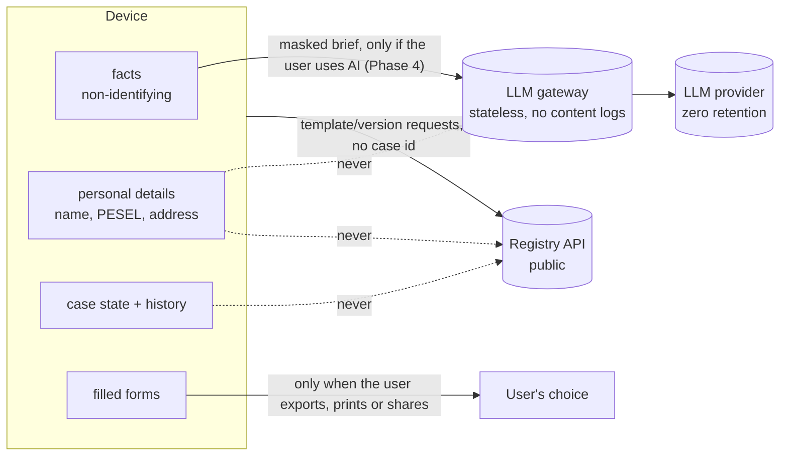

# What leaves the device

```mermaid
flowchart LR
  subgraph Device
    F[facts<br/>non-identifying]
    P[personal details<br/>name, PESEL, address]
    C[case state + history]
    A[filled forms]
  end
  R[(Registry API<br/>public)]
  G[(LLM gateway<br/>stateless, no content logs)]
  L[(LLM provider<br/>zero retention)]
  F -- "masked brief, only if the user uses AI (Phase 4)" --> G --> L
  Device -- "template/version requests, no case id" --> R
  P -. never .-> G
  P -. never .-> R
  C -. never .-> R
  A -- "only when the user exports, prints or shares" --> U[User's choice]
```

Rule (ADR-N002, ADR-0009): a network capture during the evaluation must show no personal details in any request (11 §4, item 6).
